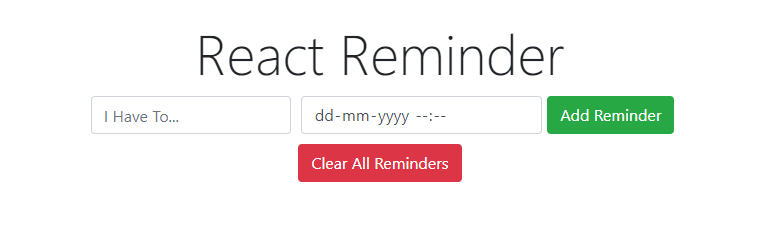

# React-Reminder
**A Reminder Web Application which is used to make reminders along with the days left.**

It works something like this:
You save the reminder along with the deadline date of completion.
And when your goal or reminder is completed you can remove the reminder from  the list.
Theres is a indication of the time left for the reminder to complete.

For saving the reminders it uses browsers cookies to save the reminders, no backend is connected with it.

**Functionality :**
 * Add Reminder
 * Add Date & Time for reminder
 * Remove Reminder
 * Clear All Reminder

After cloning the app make sure to run the command `npm install` or `npm i` to install teh modules used in the app. then run `npm start`

Below shown some of the Screenshots of the app in action:

